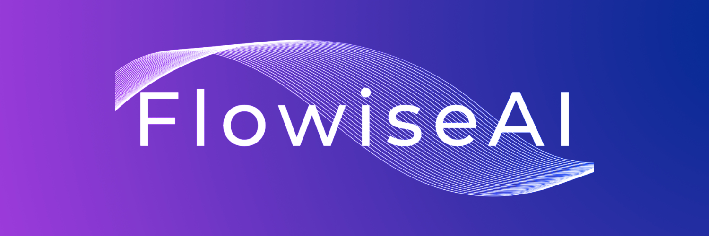
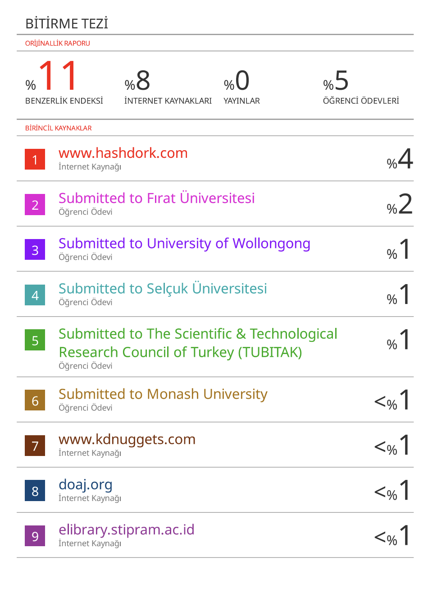
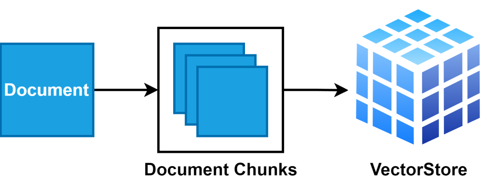

# 🎓 Graduation Project: Chatbot with Your Own Documents



## 📘 About the Project

This project is a chatbot application that allows interactive conversations with your **thesis**, **lecture notes**, and **images**. It extracts information from user-provided documents using **Flowise** and modern **LLM technologies**.

---

## 🎯 Objective

- 📄 Interact with your own PDFs, Word, TXT documents, and visuals  
- 🔍 Query academic or personal content interactively  
- ⚡ Provide quick access to both text and visual knowledge  

---

## 🧱 Project Structure

```text
├── VeyselBalçık_195260028_Thesis.pdf       → Graduation thesis (PDF)  
├── VeyselBalçık_195260028_Thesis.docx      → Word version  
├── dataset/
│   └── merged.txt                          → Combined text from thesis + notes (used by the chatbot)
├── media/
│   ├── image1.png                          → Visuals used in thesis
│   └── ...
├── index.html                              → Embeddable web chatbot interface
└── Flowise/                                → Flowise setup and source files
```

---

## 💡 Technologies Used

- **Flowise** – Drag-and-drop LLM-based chatbot builder  
- **Node.js & React** – Backend and frontend development  
- **LangChain** – Text extraction from documents  
- **Docker** – Easy setup and deployment  

---

## ⚙️ Installation & Usage

### 🔸 1. Run Locally with Flowise

```bash
npm install -g flowise
npx flowise start
```

Open: [http://localhost:3000](http://localhost:3000)

---

### 🔸 2. Run with Docker

```bash
cd Flowise/docker
cp .env.example .env
# Edit your .env file accordingly
docker-compose up -d
```

Access from: [http://localhost:3000](http://localhost:3000)

---

### 🔸 3. Embed Chatbot in Website

Use the example `index.html` file to embed the chatbot into any site.

---

## 🤖 How the Chatbot Works

- Accepts user questions and queries the content of uploaded documents  
- Answers are generated from PDF, TXT, DOCX, and image-based content  
- Images are stored in `media/` and used in responses when needed  
- The UI is fully customizable  

---

## 🖼️ Sample Images

Example visuals used in the thesis:

  
  


> See more in the `media/` folder.

---

## 📎 Document Integration

- `dataset/merged.txt`: Preprocessed plain text from thesis and notes  
- Chatbot uses this to generate relevant answers  
- Images are integrated into responses as needed

---

## 📄 License & Contribution

- This project is **open-source**.  
- Flowise and other tools are distributed under the **Apache 2.0 License**.

---

## 📬 Contact

For questions or contributions:  
→ GitHub Issues  
→ [Flowise Discord](https://discord.gg/jbaHfsRVBW)

---

## ✍️ Note

This project was developed as a **graduation thesis** by **Veysel Balçık** (2024–2025).  
All content and visuals belong to the author.

---

# 🇹🇷 Bitirme Projesi: Kendi Dökümanlarınla Chatbot


## 📘 Proje Hakkında

Bu proje, kendi hazırladığınız **bitirme tezi**, **ders notları** ve **görsellerle** etkileşim kurabilen bir **chatbot uygulamasıdır**. Kullanıcıdan gelen sorulara dökümanlardan bilgi çekerek yanıt verir. Geliştirme sürecinde **Flowise** platformu ve modern **LLM teknolojileri** kullanılmıştır.

---

## 🎯 Amaç

- 📄 Kendi PDF, Word, TXT dökümanlarınız ve görsellerinizle sohbet etmek  
- 🔍 Akademik/personal içerikleri etkileşimli şekilde sorgulamak  
- ⚡ Metin ve görsellere hızlı erişim sağlamak  

---

## 🧱 Proje Yapısı

```text
├── VeyselBalçık_195260028_BitirmeTezi.pdf     → Bitirme tezinin PDF hali  
├── VeyselBalçık_195260028_BitirmeTezi.docx    → Word formatı  
├── dataset/
│   └── merged.txt                             → Tez + notların sadeleştirilmiş metni (chatbot eğitimi)
├── media/
│   ├── image1.png                             → Tezde kullanılan görseller
│   └── ...
├── index.html                                 → Web arayüzü (gömülebilir)
└── Flowise/                                   → Flowise kaynakları ve ayarları
```

---

## 💡 Kullanılan Teknolojiler

- **Flowise** – Sürükle-bırak LLM tabanlı chatbot oluşturucu  
- **Node.js & React** – Arka plan ve arayüz geliştirme  
- **LangChain** – Dökümanlardan bilgi çıkarımı  
- **Docker** – Kolay kurulum ve yaygınlaştırma  

---

## ⚙️ Kurulum ve Kullanım

### 🔸 1. Flowise ile Lokal Kurulum

```bash
npm install -g flowise
npx flowise start
```

Tarayıcıdan: [http://localhost:3000](http://localhost:3000)

---

### 🔸 2. Docker ile Kurulum

```bash
cd Flowise/docker
cp .env.example .env
# .env dosyasını düzenleyin
docker-compose up -d
```

Tarayıcıdan erişim: [http://localhost:3000](http://localhost:3000)

---

### 🔸 3. Chatbot'u Web'e Gömme

`index.html` dosyasındaki örnekle chatbot'u sitenize yerleştirebilirsiniz.

---

## 🤖 Chatbot Nasıl Çalışır?

- Kullanıcıdan gelen sorular, yüklenen dökümanlardaki içeriklere göre cevaplanır  
- PDF, TXT, DOCX dosyaları ve görsellerden bilgi çekilir  
- `media/` klasöründeki görseller, gerektiğinde sohbet içinde sunulur  
- Arayüz özelleştirilebilir yapıdadır  

---

## 🖼️ Örnek Görseller

Tezde kullanılan bazı görseller:

  
  


> Tüm görseller için `media/` klasörüne göz atın.

---

## 📎 Tez ve Döküman Entegrasyonu

- `dataset/merged.txt`: Tez + notların sadeleştirilmiş metin hali  
- Chatbot, bu metinlerden bilgi çekerek yanıt üretir  
- Görseller cevaplara entegre edilebilir

---

## 📄 Lisans & Katkı

- Bu proje **açık kaynaklıdır**  
- Flowise ve kullanılan diğer araçlar **Apache 2.0** lisanslıdır

---

## 📬 İletişim

Görüş, öneri veya katkı için:  
→ GitHub Issues  
→ [Flowise Discord Topluluğu](https://discord.gg/jbaHfsRVBW)

---

## ✍️ Not

Bu proje, **Veysel Balçık** tarafından **2024–2025 akademik yılı** bitirme tezi olarak hazırlanmıştır.  
Tüm içerik ve görseller yazara aittir.

---
